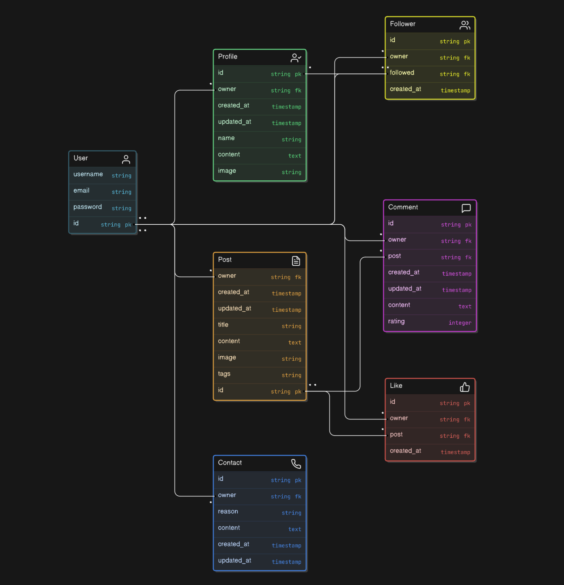

# [Better You API](https://better-you-ec0aa381f182.herokuapp.com/)

[](https://github.com/conor-timmis/Better-You-API/commits/main)
[](https://github.com/conor-timmis/Better-You-API/commits/main)
[](https://github.com/conor-timmis/Better-You-API)

# Better You: a self-improvement focused social site
This repository contains the back-end API for the Better You website. The front-end repository can be found [here](https://github.com/conor-timmis/Better-You). The back-end API is built using Django, Django REST Framework, Python, and PostgreSQL, and is hosted on Heroku.

This README focuses exclusively on the back-end components and functionality within this repository. For information on the front end, including competitor analysis, development management with GitHub Projects, and Agile methodology, please refer to the README in the front-end repository.

To visit the deployed Better You site [click here](https://better-you-fr-3267b0b1af2f.herokuapp.com/)

# Table of Contents
1. [Purpose](#1-purpose)
2. [Database Schema](#2-database-schema) 
    - [Data Validation](#data-validation)
    - [Development Notes](#development-notes)
3. [Endpoints and HTTP Requests](#3-endpoints-and-http-requests)
    - [Endpoints Overview](#endpoints-overview)
    - [Filtering and Search Options](#filtering-and-search-options)
    - [Pagination](#pagination)
4. [Testing](#4-testing)
    - [Continuous Manual Testing](#continuous-manual-testing) 
    - [Code Validation](#code-validation)
5. [Bugs](#5-bugs)
6. [Set Up and Deployment](#6-set-up-and-deployment)
7. [Credits](#7-credits)

## 1. Purpose


The goal of this API is to provide the required data to the front-end application: Better You, the dedicated space for people looking into self improvement.

## 2. Database Schema


I constructed this Entity Relationship Diagram prior to starting my project, to ensure the key entities and relationships were defined in Better You.




### Data validation 


Data validation rules ensure the accuracy and reliability of information stored in the system, ensuring all entries adhere to expected formats. Below, I have detailed the requirements either defined in my models, required by my forms or as they stand in the Abstract User model inherited from Django:

**profiles**

- profile_id: A unique integer automatically assigned by Django (primary key).
- owner: A one-to-one relationship with the User model (must correspond to an existing user).
- name: An optional string field with a maximum length of 255 characters (can be left blank).
- content: An optional text field for additional information about the user (can be left blank).
- image: A valid URL for the profile image (default image is provided), with a maximum length of 1024 characters.
- created_at: A datetime field that is automatically set when the profile is created.
- updated_at: A datetime field that automatically updates whenever the profile is modified.

**posts**

- post_id: A unique integer automatically assigned by Django (primary key).
- owner: A foreign key referencing the user who created the post (must correspond to a valid user ID).
- title: A non-empty string with a maximum length of 255 characters.
- content: A text field that can be empty (optional content for the post).
- image: A valid URL for the post's image (default image is provided), with a maximum length of 1024 characters.
- tags: Must be one of the predefined types: (Mindfulness, Motivation, Personal Growth, Time Management, Productivity, Goal Setting, Career Development, Leadership), with a default value of "Personal Growth."
- created_at: A datetime field automatically set upon creation of the post instance.
- updated_at: A datetime field that updates automatically whenever the post is modified.

**likes**

- like_id: A unique integer automatically assigned by Django (primary key).
- owner: A foreign key referencing an existing user (must correspond to a valid user ID).
- post: A foreign key referencing the associated post (must correspond to a valid post ID).
- created_at: A datetime field automatically assigned when the like is created.
- updated_at: A datetime field that may initially be empty and updates with the last modification timestamp.

**comments**

- comment_id: A unique integer automatically assigned by Django (primary key).
- owner: A foreign key referencing the user who made the comment (must correspond to a valid user ID).
- post: A foreign key referencing the associated post (must correspond to a valid post ID).
- content: A mandatory text field for the comment's content.
- created_at: A datetime field automatically set when the comment is created.
- updated_at: A datetime field that automatically updates with the last modification timestamp.
- rating: An optional integer field to store a rating associated with the comment (default is 0).

**followers**

- follower_id: A unique integer automatically assigned by Django (primary key).
- owner: A foreign key referencing the user who is following (must correspond to a valid user ID).
- followed: A foreign key referencing the user who is being followed (must correspond to a valid user ID).
- created_at: A datetime field automatically set when the follow relationship is created.


## 3. Endpoints and HTTP Requests 


This section outlines the key API endpoints for the application, detailing the HTTP methods, authentication and authorisation requirements, as well as descriptions for each operation. These endpoints allow interaction with core features, such as user management, profiles, posts, comments, and ratings. All endpoints are designed to follow RESTful principles, making them intuitive and easy to work with in client applications.

### Endpoints Overview


The table below provides an overview of the available endpoints, the supported HTTP methods, and the associated authentication or authorisation requirements:


| Endpoint                                | Allowed Methods           | Authentication/Authorization      | Description                                |
|-----------------------------------------|---------------------------|-----------------------------------|--------------------------------------------|
| `/`                                     | GET                       | No authentication required        | Root route or home page                    |
| `/admin/`                               | GET, POST, etc.           | Admin authentication required     | Admin site                                 |
| `/api-auth/`                            | GET, POST, etc.           | No authentication required        | REST framework authentication              |
| `/dj-rest-auth/logout/`                 | POST                      | Authentication required           | User logout                                |
| `/dj-rest-auth/`                        | Various                   | No authentication required        | DJ Rest Auth endpoints                     |
| `/dj-rest-auth/registration/`           | POST                      | No authentication required        | User registration endpoint                 |
| `/profiles/`                            | GET, POST                 | Authentication required           | List all profiles or create a profile      |
| `/profiles/<int:pk>/`                   | GET, PATCH, DELETE        | Authentication required           | Retrieve, update, or delete a profile      |
| `/comments/`                            | GET, POST                 | Authentication required           | List all comments or create a comment      |
| `/comments/<int:pk>/`                   | GET, PATCH, DELETE        | Authentication required           | Retrieve, update, or delete a comment      |
| `/posts/`                               | GET, POST                 | Authentication required           | List all posts or create a post            |
| `/posts/<int:pk>/`                      | GET, PATCH, DELETE        | Authentication required           | Retrieve, update, or delete a post         |
| `/followers/`                           | GET, POST                 | Authentication required           | List all followers or add a follower       |
| `/followers/<int:pk>/`                  | DELETE                    | Authentication required           | Unfollow a user                            |
| `/likes/`                               | GET, POST                 | Authentication required           | List all likes or add a like               |
| `/likes/<int:pk>/`                      | DELETE                    | Authentication required           | Remove a like                              |
| `/contacts/`                            | GET, POST                 | Authentication required           | List all contacts or create a contact      |
| `/contacts/<int:pk>/`                   | GET, PATCH, DELETE        | Authentication required           | Retrieve, update, or delete a contact      |


### Filtering and Search Options


To enhance the flexibility of the API, several endpoints provide options for filtering and sorting results. This allows the frontend to tailor its requests to specific needs, retrieving only the most relevant data. The table below outlines the filtering and search capabilities of the key endpoints:


### Filtering and Search Options


To enhance the flexibility of the API, several endpoints provide options for filtering and sorting results. This allows the frontend to tailor its requests to specific needs, retrieving only the most relevant data. The table below outlines the filtering and search capabilities of the key endpoints:

| Endpoint                                  | Filtering Options                                       | Search Options                                    |
|-------------------------------------------|---------------------------------------------------------|---------------------------------------------------|
| dj-rest-auth/login                        | None                                                    | None                                              |
| dj-rest-auth/logout                       | None                                                    | None                                              |
| dj-rest-auth/registration/                | None                                                    | None                                              |
| profiles/                                 | Sort profiles by any field, defaults to sorting by ID   | Search by User                                    |
| profile/<int:id>/                         | None                                                    | None                                              |
| profile/<int:id>/followers/               | Filter by follower's profile ID, sort by any field      | None                                              |
| posts/                                    | Filter by author, date created, or tags                 | Search by title, content, or author name          |
| posts/create/                             | None                                                    | None                                              |
| posts/<int:id>/                           | None                                                    | None                                              |
| posts/<int:id>/comments/                  | Sort comments by creation date, filter by author ID     | None                                              |
| contacts/                                 | Filter by reason, created_at, user ID                   | Search by reason, content, username               |
| contact/create/                           | None                                                    | None                                              |
| contacts/<int:id>/                        | Sort comments by creation date, filter by author ID     | None                                              |


## Pagination


To handle larger datasets and ensure good performance, all list-based endpoints utilize pagination. This structure helps limit the number of results returned in a single response. The following structure describes the pagination response format:

```json
{
    "comments": {
        "count": 50,
        "next": "/comments/?post=1&page=2",
        "previous": null,
        "results": [
            {
                "id": 1,
                "content": "This is the first comment.",
                "author": "user1",
                "created_at": "2024-10-20T12:00:00Z"
            },
            {
                "id": 2,
                "content": "This is the second comment.",
                "author": "user2",
                "created_at": "2024-10-21T14:30:00Z"
            }
        ]
    },
    "followers": {
        "count": 100,
        "next": "/profiles/?page=2",
        "previous": null,
        "results": [
            {
                "id": 1,
                "username": "john_doe",
                "profile_image": "url/to/image.jpg",
                "followers_count": 150
            },
            {
                "id": 2,
                "username": "jane_smith",
                "profile_image": "url/to/image2.jpg",
                "followers_count": 200
            }
        ]
    },
    "posts": {
        "count": 64,
        "next": "/posts/?page=2",
        "previous": null,
        "results": [
            {
                "id": 1,
                "title": "First Post",
                "content": "This is the content of the first post.",
                "author": "author123",
                "created_at": "2024-10-20T12:00:00Z"
            },
            {
                "id": 2,
                "title": "Second Post",
                "content": "This is the content of the second post.",
                "author": "author456",
                "created_at": "2024-10-21T14:30:00Z"
            }
        ]
    }
}
```

## 4. Testing


### Continuous Manual Testing


Manual testing was performed throughout the development process to ensure that all API endpoints, models, and interactions between the backend and the frontend worked as expected. Below is an overview of key areas tested, along with specific tests performed and edge cases covered:

1. **User Registration and Authentication**

**Goal**: To ensure that user registration, login, and logout processes are functioning as intended.

**Tests**:
- Successfully registered a new user and verified their data (user, profile image, bio) was stored correctly in the database.
- Logged in using valid credentials and checked that the appropriate response, including authentication tokens, was returned.
- Logged out and confirmed that the user's session was invalidated.

**Edge Cases**:
- Attempted to register with invalid data (e.g., mismatched passwords, missing fields) to ensure proper validation messages.
- Tried logging in with incorrect credentials to verify that error messages were displayed, and no tokens were issued.

2. **Profile and User Data Management**

**Goal**: To validate that profiles can be retrieved, updated, and deleted, and that users can manage their own profiles.

**Tests**:
- Created new profiles, updated personal details (e.g., bio, profile image URL), and verified changes were reflected in the database.
- Ensured that profiles could be retrieved by their ID and displayed correctly on the front end.
- Deleted a profile and verified that related data (e.g., posts) were handled appropriately in the database.

**Edge Case**:
- Attempted to update another user's profile without proper authorisation to ensure access was restricted.

3. **Post Management**

**Goal**: To verify that users can create, update, and delete posts, and that related data (e.g., comments, ratings) is stored correctly.

**Tests**:
- Created new post with valid data and confirmed they appeared in the database.
- Edited the title, image in the post and verified the updates persisted.
- Deleted a post and confirmed it was removed from the user's profile and that related comments or ratings were handled correctly.

**Edge Cases**:
- Submitted incomplete forms (e.g., missing required fields) to test that validation prevented improper submissions.
- Ensured users could not edit or delete posts they did not own.

4. **Comments and Ratings**

**Goal**: To ensure that comments and ratings can be added to posts and that data integrity is maintained across the system.

**Tests**:
- Created comments on various posts and verified they were stored correctly and displayed on the front end.
- Rated posts and ensured that the rating was averaged correctly for the post.
- Deleted comments and ratings and ensured that the correct entries were removed from the database.

**Edge Cases**:
- Tried posting empty comments to test that validation prevented submission.
- Tested the system to ensure users could not rate their own posts.

5. **Followers and Notifications**

**Goal**: To verify that users can follow other profiles and receive notifications for relevant interactions.

**Tests**:
- Followed and unfollowed users, checking that the follower relationships were stored and deleted correctly.
- Created notifications via actions new comments, ratings, or follows, and ensured that they were delivered to the correct users.

### Code Validation

The code I wrote was also passed through validators/linters at the end to ensure adherence to coding standards and best practices, ultimately aiming for robust and maintainable code. All files have been formatted according to PEP8 standards and corrected, with the exception of the settings.py file in the betteryou_api directory. I found that some lines, particularly those containing lengthy URLs in the ALLOWED_HOSTS section, exceeded the recommended line length for formatting. This is just one example; there are several similar instances within the settings file.

| Language | File | Validation Method | Outcome |
| --- | --- | --- | --- |
| Python | betteryou_api settings.py | [CI Python Linter](https://pep8ci.herokuapp.com/) | Lines that are too long, due to inability to format the URLs, otherwise error-less |
| Python | comments models.py | [CI Python Linter](https://pep8ci.herokuapp.com/) | All errors resolved |
| Python | comments serializers.py | [CI Python Linter](https://pep8ci.herokuapp.com/) | All errors resolved |
| Python | comments urls.py  | [CI Python Linter](https://pep8ci.herokuapp.com/) | All errors resolved |
| Python | comments views.py  | [CI Python Linter](https://pep8ci.herokuapp.com/) | All errors resolved |
| Python | followers models.py | [CI Python Linter](https://pep8ci.herokuapp.com/) | All errors resolved |
| Python | followers serializers.py | [CI Python Linter](https://pep8ci.herokuapp.com/) | All errors resolved |
| Python | followers urls.py  | [CI Python Linter](https://pep8ci.herokuapp.com/) | All errors resolved |
| Python | followers views.py  | [CI Python Linter](https://pep8ci.herokuapp.com/) | All errors resolved |
| Python | likes models.py | [CI Python Linter](https://pep8ci.herokuapp.com/) |  All errors resolved |
| Python | likes serializers.py | [CI Python Linter](https://pep8ci.herokuapp.com/) | All errors resolved |
| Python | likes urls.py  | [CI Python Linter](https://pep8ci.herokuapp.com/) | All errors resolved |
| Python | likes views.py  | [CI Python Linter](https://pep8ci.herokuapp.com/) | All errors resolved |
| Python | posts models.py | [CI Python Linter](https://pep8ci.herokuapp.com/) | All errors resolved |
| Python | posts serializers.py | [CI Python Linter](https://pep8ci.herokuapp.com/) | All errors resolved |
| Python | posts urls.py  | [CI Python Linter](https://pep8ci.herokuapp.com/) | All errors resolved |
| Python | posts views.py  | [CI Python Linter](https://pep8ci.herokuapp.com/) | All errors resolved |
| Python | contacts models.py | [CI Python Linter](https://pep8ci.herokuapp.com/) | All errors resolved |
| Python | contacts serializers.py | [CI Python Linter](https://pep8ci.herokuapp.com/) | All errors resolved |
| Python | contacts urls.py  | [CI Python Linter](https://pep8ci.herokuapp.com/) | All errors resolved |
| Python | contacts views.py  | [CI Python Linter](https://pep8ci.herokuapp.com/) | All errors resolved |


## 5. Bugs


I did not bump into any bugs in terms of the backend, I did struggle setting up initially but I could not class them as "bugs" so I will have to leave this as N/A. There were bugs on the frontend which will be mentioned in that README sheet.

## 6. Set Up and Deployment

### Django Rest Framework Backend Set Up


1. Set Environment Variables
    Defined and set the necessary environment variables in my project to configure the backend with external services and security settings: 
    - CLIENT_ORIGIN: set this to the URL of the frontend app that will be making requests to the backend.
    - DATABASE_URL: specified the PostgreSQL database connection string. 
    - DISABLE_COLLECTSTATIC: set this to '1' to skip static file collection during deployment, used for Heroku deployments. 
    - SECRET_KEY: defined a secret key for Django's security features.

2. Installed Libraries for Database Connection
    Installed the necessary libraries to handle the database connection and configuration: 
    - psycopg2: PostgreSQL adapter for Python to allow Django to interact with a PostgreSQL database.
    - dj-database-url: simplifies the database configuration by allowing the use of a single DATABASE_URL environment variable. 

3. Configured dj-rest-auth for JWT Authentication
    Set up dj-rest-auth to handle JSON Web Token (JWT) authentication for the API. This involved updating the Django settings file to use dj-rest-auth as the authentication system.
    - Updated INSTALLED_APPS with dj_rest_auth and rest_framework.
    - Set JWT-specific settings in the settings.py file for token handling. 

4. Set Allowed Hosts
    Configured ALLOWED_HOSTS in the settings.py file to ensure that only trusted domains can access the backend. I added the domain of the deployed app and any relevant subdomains. 

5. Configured CORS
    Set up Cross-Origin Resource Sharing (CORS) to control which origins are permitted to interact with the API. Installed and configured the django-cors-headers library. 

6. Set Default Renderer to JSON
    Configured the default renderer in the Django REST framework to JSON to ensure API responses are sent in the correct format. 

7. Added a Procfile for Heroku Deployment
    Created a Procfile in the root directory of the project to instruct Heroku on how to run the application. This includes commands for running the web server and managing database migrations. 

8. Ignored env.py
    For security purposes, I created an env.py file to store environment variables locally and added it to .gitignore to ensure it is not tracked by version control.

9. Generated requirements.txt
    Created a requirements.txt file via pip, which lists all the Python dependencies needed to run the project. 

### Running Locally


- Install Python and PostgreSQL
- Set up a virtual environment and install the dependencies with pip install -r requirements.txt
- Apply DB Migrations with python manage.py migrate
- Run the development server with python manage.py runserver


### Deployment


The live deployed application can be found deployed on [Heroku](https://better-you-ec0aa381f182.herokuapp.com/)


### PostgreSQL Database

This project uses a [Code Institute PostgreSQL Database](https://dbs.ci-dbs.net).

To obtain my own Postgres Database from Code Institute, I followed these steps:

- Signed-in to the CI LMS using my email address.
- An email was sent to me with my new Postgres Database.

> [!CAUTION]  
> - PostgreSQL databases by Code Institute are only available to CI Students.
> - You must acquire your own PostgreSQL database through some other method
> if you plan to clone/fork this repository.
> - Code Institute students are allowed a maximum of 8 databases.
> - Databases are subject to deletion after 18 months.


### Heroku Deployment

This project uses [Heroku](https://www.heroku.com), a platform as a service (PaaS) that enables developers to build, run, and operate applications entirely in the cloud.

Deployment steps are as follows, after account setup:

- Select **New** in the top-right corner of your Heroku Dashboard, and select **Create new app** from the dropdown menu.
- Your app name must be unique, and then choose a region closest to you (EU or USA), and finally, select **Create App**.
- From the new app **Settings**, click **Reveal Config Vars**, and set your environment variables.

> [!IMPORTANT]  
> This is a sample only; you would replace the values with your own if cloning/forking my repository.

| Key | Value |
| --- | --- |
| `DATABASE_URL` | user's own value |
| `DISABLE_COLLECTSTATIC` | 1 (*this is temporary, and can be removed for the final deployment*) |
| `SECRET_KEY` | user's own value |

Heroku needs three additional files in order to deploy properly.

- requirements.txt
- Procfile
- runtime.txt

You can install this project's **requirements** (where applicable) using:

- `pip3 install -r requirements.txt`

If you have your own packages that have been installed, then the requirements file needs updated using:

- `pip3 freeze --local > requirements.txt`

The **Procfile** can be created with the following command:

- `echo web: gunicorn app_name.wsgi > Procfile`
- *replace **app_name** with the name of your primary Django app name; the folder where settings.py is located*

The **runtime.txt** file needs to know which Python version you're using:
1. type: `python3 --version` in the terminal.
2. in the **runtime.txt** file, add your Python version:
	- `python-3.9.19`

For Heroku deployment, follow these steps to connect your own GitHub repository to the newly created app:

Either:

- Select **Automatic Deployment** from the Heroku app.

Or:

- In the Terminal/CLI, connect to Heroku using this command: `heroku login -i`
- Set the remote for Heroku: `heroku git:remote -a app_name` (replace *app_name* with your app name)
- After performing the standard Git `add`, `commit`, and `push` to GitHub, you can now type:
	- `git push heroku main`

The project should now be connected and deployed to Heroku!


## 7. Credits


I referred to the Code Institute material on Django Rest Framework and related concepts.

- I built my flowcharts using [Mermaid](https://mermaid.js.org/syntax/flowchart.html) in my README.
- I used [ChatGPT](https://chatgpt.com) to explain error messages and research the best way to go about my implementation.
- I found my Django settings configuration for JWT cookies in [this article](https://medium.com/@michal.drozdze/django-rest-apis-with-jwt-authentication-using-dj-rest-auth-781a536dfb49#:~:text=If%20you%20need%20to%20refresh,%2Ftoken%2Frefresh%2F%20endpoint.)

I also used the documentation of all the elements included in this project: 
- [Django](https://docs.djangoproject.com/en/4.2/)
- [Django REST Framework](https://www.django-rest-framework.org/)
- [PostgreSQL](https://www.postgresql.org/docs/current/)


### Acknowledgements


- I would like to thank my Code Institute mentor, [Gareth McGirr](https://github.com/Gareth-McGirr/) for his support throughout the development of this project.
- I would like to thank the [Code Institute](https://codeinstitute.net) tutor team for their assistance with troubleshooting and debugging some project issues.
